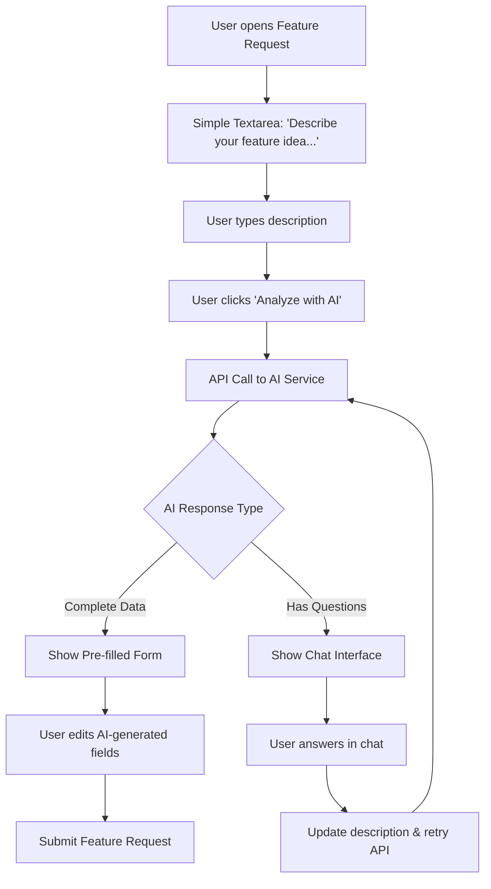
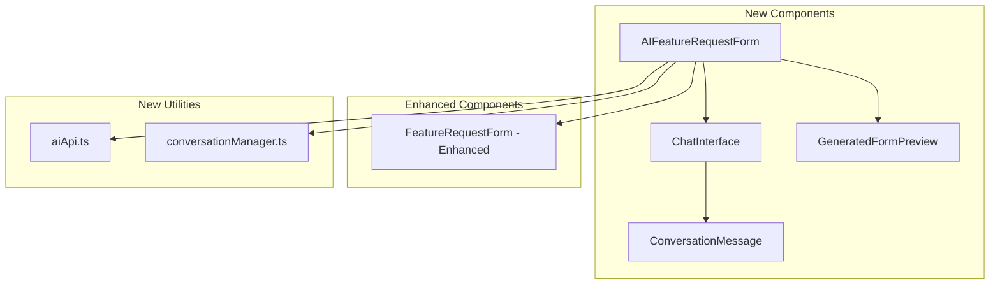

# 🤖 AI-Powered Feature Request Simplification Plan

## Overview

Transform the current multi-field feature request form into an intelligent, conversational interface that uses AI to extract structured information from natural language descriptions.

## Current State Analysis

The existing implementation has:
- **Complex Form**: 4 separate fields (title, description, use case, proposed solution)
- **Manual Input**: Users must think about how to structure their request
- **High Friction**: Multiple required fields can discourage submissions

## Proposed Solution Architecture

### 1. User Experience Flow



### 2. Component Architecture



## 3. Technical Implementation Plan

### Phase 1: Core AI Integration

#### 3.1 Create AI API Service
**File**: `src/featureRequest/utils/aiApi.ts`

```typescript
interface AIAnalysisRequest {
  description: string;
}

interface AIAnalysisResponse {
  question?: string;
  title?: string;
  description?: string;
  use_case?: string;
  solution?: string;
}

export async function analyzeFeatureDescription(description: string): Promise<AIAnalysisResponse>
```

**API Details:**
- **Endpoint**: `https://n8n.webuilder.dev/webhook/c713c0fb-a7e7-4693-b954-180ce35cf416`
- **Request**: `POST { description: string }`
- **Response**: `{ question: string }` OR `{ title, description, use_case, solution }`

#### 3.2 Conversation Management
**File**: `src/featureRequest/utils/conversationManager.ts`

```typescript
interface ConversationMessage {
  id: string;
  type: 'user' | 'ai';
  content: string;
  timestamp: Date;
}

export class ConversationManager {
  private messages: ConversationMessage[] = [];
  
  addUserMessage(content: string): void
  addAIMessage(content: string): void
  getFullDescription(): string // Combines all user messages
  getMessages(): ConversationMessage[]
  reset(): void
}
```

### Phase 2: UI Components

#### 2.1 Chat Interface Component
**File**: `src/featureRequest/components/ChatInterface.tsx`

Features:
- Display conversation history
- Input field for user responses
- Loading states during AI processing
- Auto-scroll to latest message
- Message bubbles with user/AI styling

#### 2.2 AI Feature Request Form
**File**: `src/featureRequest/components/AIFeatureRequestForm.tsx`

Features:
- Initial textarea for feature description
- "Analyze with AI" button
- Conditional rendering of chat interface or generated form
- Integration with existing submission logic
- Fallback to manual form option

#### 2.3 Generated Form Preview
**File**: `src/featureRequest/components/GeneratedFormPreview.tsx`

Features:
- Display AI-generated fields with clear labels
- Allow editing of each field
- Validation and character limits
- Submit functionality
- "Regenerate with AI" option

### Phase 3: Enhanced User Experience

#### 3.1 State Management
**File**: `src/featureRequest/hooks/useAIFeatureRequest.ts`

```typescript
interface AIFeatureRequestState {
  stage: 'input' | 'analyzing' | 'conversation' | 'preview' | 'submitting';
  conversation: ConversationManager;
  generatedData: Partial<FeatureRequest> | null;
  isLoading: boolean;
  error: string | null;
}

export function useAIFeatureRequest() {
  // State management for AI-powered feature request flow
}
```

#### 3.2 Integration Points
- Replace current `FeatureRequestForm` with `AIFeatureRequestForm` in main component
- Update `featureRequest.tsx` to use new component
- Maintain backward compatibility with existing API
- Add toggle for users who prefer manual form entry

## 4. Implementation Details

### 4.1 Conversation Flow Logic
1. **Initial Input**: User enters description in textarea
2. **AI Analysis**: Send description to AI API
3. **Response Handling**:
   - If AI returns question: Show chat interface, add question, wait for response
   - If AI returns complete data: Show generated form preview
4. **Iterative Refinement**: Continue conversation until AI has enough information
5. **Form Generation**: Display editable form with AI-generated content
6. **Submission**: Use existing API with user-approved data

### 4.2 Error Handling & Fallbacks
- **Network Failures**: Show error message with retry option
- **Invalid AI Responses**: Graceful degradation to manual form
- **Service Unavailable**: Automatic fallback to original form
- **Timeout Handling**: Cancel long-running AI requests
- **User Escape**: Always provide option to use manual form

### 4.3 Performance Considerations
- **Debounced Requests**: Prevent rapid API calls during typing
- **Conversation Caching**: Store conversation state locally
- **Optimized Rendering**: Minimize re-renders during chat
- **Loading States**: Clear feedback during AI processing
- **Progressive Enhancement**: Core functionality works without AI

### 4.4 Accessibility Features
- **Keyboard Navigation**: Full keyboard support for chat interface
- **Screen Reader Support**: Proper ARIA labels and announcements
- **Focus Management**: Logical focus flow through conversation
- **High Contrast**: Ensure chat bubbles meet contrast requirements

## 5. File Structure Changes

```
src/featureRequest/
├── components/
│   ├── AIFeatureRequestForm.tsx          # NEW - Main AI-powered form
│   ├── ChatInterface.tsx                 # NEW - Conversation UI
│   ├── ConversationMessage.tsx           # NEW - Individual message component
│   ├── GeneratedFormPreview.tsx          # NEW - AI-generated form preview
│   ├── FeatureRequestForm.tsx            # ENHANCED - Fallback/manual mode
│   ├── FeatureList.tsx                   # UNCHANGED
│   └── PermissionRequest.tsx             # UNCHANGED
├── hooks/
│   ├── useAIFeatureRequest.ts            # NEW - AI form state management
│   ├── useFeatureRequests.ts             # UNCHANGED
│   └── useUserId.ts                      # UNCHANGED
├── utils/
│   ├── aiApi.ts                          # NEW - AI service integration
│   ├── conversationManager.ts            # NEW - Conversation logic
│   └── api.ts                            # UNCHANGED
└── featureRequest.tsx                    # MODIFIED - Use new AI form
```

## 6. User Interface Design

### 6.1 Initial State
```
┌─────────────────────────────────────────┐
│ 📝 Submit New Feature Request          │
├─────────────────────────────────────────┤
│ Describe your feature idea and why you  │
│ need it. Our AI will help structure    │
│ your request.                           │
│                                         │
│ ┌─────────────────────────────────────┐ │
│ │ I would like to add a feature that  │ │
│ │ allows me to...                     │ │
│ │                                     │ │
│ │                                     │ │
│ └─────────────────────────────────────┘ │
│                                         │
│ [Analyze with AI] [Use Manual Form]     │
└─────────────────────────────────────────┘
```

### 6.2 Chat Interface State
```
┌─────────────────────────────────────────┐
│ 🤖 AI Assistant                        │
├─────────────────────────────────────────┤
│ 👤 I want to download multiple pages   │
│    at once                             │
│                                         │
│ 🤖 That sounds useful! Could you tell  │
│    me more about when you would use    │
│    this feature? For example, are you  │
│    trying to download related pages    │
│    from the same website?              │
│                                         │
│ ┌─────────────────────────────────────┐ │
│ │ Type your response...               │ │
│ └─────────────────────────────────────┘ │
│                              [Send]     │
└─────────────────────────────────────────┘
```

### 6.3 Generated Form Preview State
```
┌─────────────────────────────────────────┐
│ ✨ AI-Generated Feature Request        │
├─────────────────────────────────────────┤
│ Review and edit the details below:      │
│                                         │
│ Title: *                                │
│ ┌─────────────────────────────────────┐ │
│ │ Batch Download Multiple Pages       │ │
│ └─────────────────────────────────────┘ │
│                                         │
│ Description: *                          │
│ ┌─────────────────────────────────────┐ │
│ │ Allow users to select and download  │ │
│ │ multiple web pages simultaneously   │ │
│ └─────────────────────────────────────┘ │
│                                         │
│ [Regenerate with AI] [Submit Request]   │
└─────────────────────────────────────────┘
```

## 7. Benefits of This Approach

### User Benefits
- **Simplified Input**: Single textarea instead of multiple fields
- **Guided Process**: AI asks clarifying questions when needed
- **Smart Suggestions**: AI generates structured content from natural language
- **User Control**: Can edit AI-generated content before submission
- **Faster Submission**: Reduced cognitive load and form completion time

### Developer Benefits
- **Modular Design**: New components don't break existing functionality
- **Fallback Support**: Original form remains available
- **Extensible**: Easy to add more AI features later
- **Maintainable**: Clear separation of concerns
- **Testable**: Each component can be tested independently

### Business Benefits
- **Higher Conversion**: More users likely to complete simplified form
- **Better Quality**: AI helps users provide more complete information
- **Reduced Support**: Clearer, more structured feature requests
- **User Satisfaction**: Modern, intelligent user experience

## 8. Success Metrics

### Quantitative Metrics
- **Form Completion Rate**: % of users who start and finish the form
- **Submission Quality Score**: Completeness of submitted requests
- **Time to Completion**: Average time from start to submission
- **AI Success Rate**: % of requests successfully processed by AI
- **User Retention**: Return usage of feature request system

### Qualitative Metrics
- **User Feedback**: Satisfaction surveys about the AI assistance
- **Request Clarity**: Manual review of request quality improvement
- **Support Ticket Reduction**: Fewer clarification requests needed
- **Developer Satisfaction**: Easier to understand and prioritize requests

## 9. Implementation Timeline

### Week 1: Foundation
- [ ] Create AI API service (`aiApi.ts`)
- [ ] Implement conversation manager (`conversationManager.ts`)
- [ ] Set up basic state management hook (`useAIFeatureRequest.ts`)

### Week 2: Core Components
- [ ] Build chat interface component (`ChatInterface.tsx`)
- [ ] Create conversation message component (`ConversationMessage.tsx`)
- [ ] Implement generated form preview (`GeneratedFormPreview.tsx`)

### Week 3: Integration
- [ ] Create main AI feature request form (`AIFeatureRequestForm.tsx`)
- [ ] Integrate with existing feature request page
- [ ] Add fallback mechanisms and error handling

### Week 4: Polish & Testing
- [ ] Add loading states and animations
- [ ] Implement accessibility features
- [ ] Comprehensive testing and bug fixes
- [ ] Documentation and deployment

## 10. Future Enhancements

### Phase 2 Features
- **Smart Templates**: AI suggests feature request templates based on common patterns
- **Duplicate Detection**: AI identifies similar existing requests
- **Priority Scoring**: AI helps estimate feature complexity and impact
- **Auto-categorization**: AI tags requests with relevant categories

### Phase 3 Features
- **Voice Input**: Allow users to describe features verbally
- **Image Analysis**: AI analyzes screenshots or mockups
- **Integration Suggestions**: AI recommends related features
- **Progress Updates**: AI-generated status updates for submitted requests

This comprehensive plan provides a roadmap for creating an intelligent, user-friendly feature request system that leverages AI to simplify the submission process while maintaining the quality and structure needed for effective feature development.