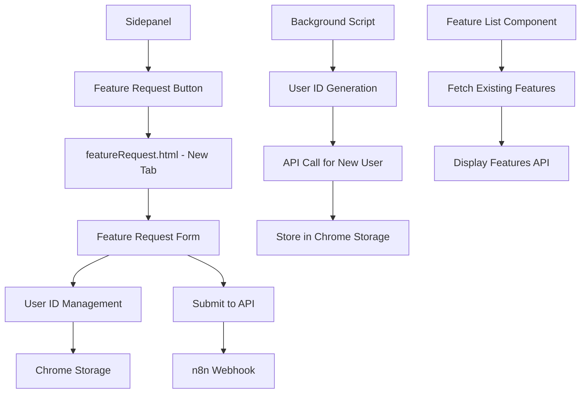

# Feature Request System - Implementation Plan

## 📋 Overview
This document outlines the complete plan for implementing a Feature Request system in the Web Page Downloader Chrome extension. Users will be able to submit feature requests through a dedicated page with automatic user ID generation and management.

## 🎯 Requirements
- **Feature Request Form**: Title, Description, Use Case/Problem, Proposed Solution
- **User ID System**: Unique ID per user stored in Chrome storage
- **API Integration**: 
  - Submit feature: `https://n8n.webuilder.dev/webhook/71a655f2-7498-4553-9678-46c49b4fd5e8`
  Response: {"id": 1}
  - Get features: `https://n8n.webuilder.dev/webhook/0bd715f9-d441-4cdd-be43-d5b9e031203a`
  Response: [{"id":1,"Status":"New","Title":"Esimene","Description":"Description","Use_Case":"Use case text","Solution":"Solution text","Created":1751490000}]
  - Create user ID: `https://n8n.webuilder.dev/webhook/40fa49f0-df07-431b-915d-f04a87e55996`
  Response: {"id":4}
- **Navigation**: Button in sidepanel that opens new tab with feature request page

## 🏗️ Architecture Design



## 📁 File Structure Plan

```
src/
├── featureRequest/
│   ├── featureRequest.tsx          # Main React component
│   ├── components/
│   │   ├── FeatureRequestForm.tsx  # Form component
│   │   ├── FeatureList.tsx         # Display existing features
│   │   └── UserIdManager.tsx       # User ID management
│   ├── hooks/
│   │   ├── useUserId.ts           # Custom hook for user ID
│   │   └── useFeatureRequests.ts  # Custom hook for API calls
│   └── utils/
│       └── api.ts                 # API utility functions
├── background/
│   └── userIdManager.ts           # Background user ID logic
└── components/
    └── FeatureRequestButton.tsx   # Button for sidepanel
featureRequest.html                 # New HTML page
```

## 🔧 Technical Implementation Plan

### 1. User ID Management System
- **Generation**: Create UUID when extension is first installed/used or after update for existing users
- **Storage**: Use `chrome.storage.local` for persistence
- **API Integration**: Call user creation API when generating new ID
- **Fallback**: Handle offline scenarios gracefully

### 2. Feature Request Data Structure
```typescript
interface FeatureRequest {
  id?: string;           // Generated by API
  userId: string;        // From Chrome storage
  title: string;         // Required, max 100 chars
  description: string;   // Required, max 1000 chars
  useCase: string;       // Required, max 500 chars
  proposedSolution: string; // Optional, max 500 chars
  timestamp: string;     // Auto-generated
  status?: string;       // Set by API
}
```

### 3. API Integration
- **Submit Feature**: `POST https://n8n.webuilder.dev/webhook/71a655f2-7498-4553-9678-46c49b4fd5e8`
- **Get Features**: `GET https://n8n.webuilder.dev/webhook/0bd715f9-d441-4cdd-be43-d5b9e031203a`
- **Create User ID**: `POST https://n8n.webuilder.dev/webhook/40fa49f0-df07-431b-915d-f04a87e55996`

### 4. UI Components Design

**Feature Request Form:**
- Clean, modern design matching existing extension style
- Form validation with real-time feedback
- Character counters for text fields
- Success/error states
- Loading indicators

**Feature List Display:**
- Paginated list of existing feature requests
- Filter by status (if available)
- Search functionality
- User's own requests highlighted

### 5. Navigation Integration
- Add "Feature Request" button to sidepanel header/footer
- Button opens new tab with `chrome.tabs.create()`
- Consistent styling with existing buttons

## 🎨 UI/UX Design Plan

### Sidepanel Integration
```tsx
// Add to MainContent.tsx or create separate component
<div className="mt-4 pt-4 border-t">
  <Button 
    variant="outline" 
    onClick={openFeatureRequestPage}
    className="w-full"
  >
    💡 Request Feature
  </Button>
</div>
```

### Feature Request Page Layout
```
┌─────────────────────────────────────┐
│ 🔧 Web Page Downloader - Features  │
├─────────────────────────────────────┤
│                                     │
│ 📝 Submit New Feature Request       │
│ ┌─────────────────────────────────┐ │
│ │ Title: [________________]       │ │
│ │ Description: [____________]     │ │
│ │ Use Case: [_______________]     │ │
│ │ Solution: [_______________]     │ │
│ │           [Submit Request]      │ │
│ └─────────────────────────────────┘ │
│                                     │
│ 📋 Existing Feature Requests        │
│ ┌─────────────────────────────────┐ │
│ │ • Feature 1 - Status: New  │ │
│ │ • Feature 2 - Status: In Developement   │ │
│ │ • Feature 3 - Status: Done     │ │
│ └─────────────────────────────────┘ │
└─────────────────────────────────────┘
```

## 🔄 Implementation Steps

### Phase 1: User ID System
- Create user ID management utilities
- Implement background script logic
- Add Chrome storage integration
- Test user ID generation and persistence

### Phase 2: Feature Request Form
- Create new HTML page and React components
- Implement form validation and submission
- Add API integration for submitting requests
- Style components to match extension design

### Phase 3: Feature Display
- Implement feature list component
- Add API integration for fetching features
- Create filtering and search functionality
- Add pagination if needed

### Phase 4: Integration
- Add button to sidepanel
- Implement tab opening functionality
- Test complete user flow
- Add error handling and loading states

## 🛡️ Error Handling & Edge Cases

- **Offline Scenarios**: Queue requests for later submission
- **API Failures**: Show user-friendly error messages
- **Storage Failures**: Fallback to session storage
- **Invalid Data**: Client-side validation with clear feedback
- **Rate Limiting**: Implement submission cooldown

## 🧪 Testing Strategy

- **User ID Generation**: Test first-time users and existing users
- **Form Validation**: Test all field combinations and edge cases
- **API Integration**: Test success/failure scenarios
- **Cross-browser**: Ensure compatibility across Chrome versions
- **Storage**: Test storage limits and cleanup

## 📊 Success Metrics

- **Functionality**: All features work as specified
- **Performance**: Page loads under 2 seconds
- **Usability**: Intuitive form completion flow
- **Reliability**: 99%+ success rate for submissions
- **Integration**: Seamless experience from sidepanel

## 🚀 Next Steps

1. Review and approve this plan
2. Switch to Code mode for implementation
3. Begin with Phase 1: User ID System
4. Iterate through each phase with testing
5. Deploy and monitor user feedback

---

*This plan provides a comprehensive Feature Request system that integrates seamlessly with the existing Chrome extension while maintaining consistent design patterns and user experience.*