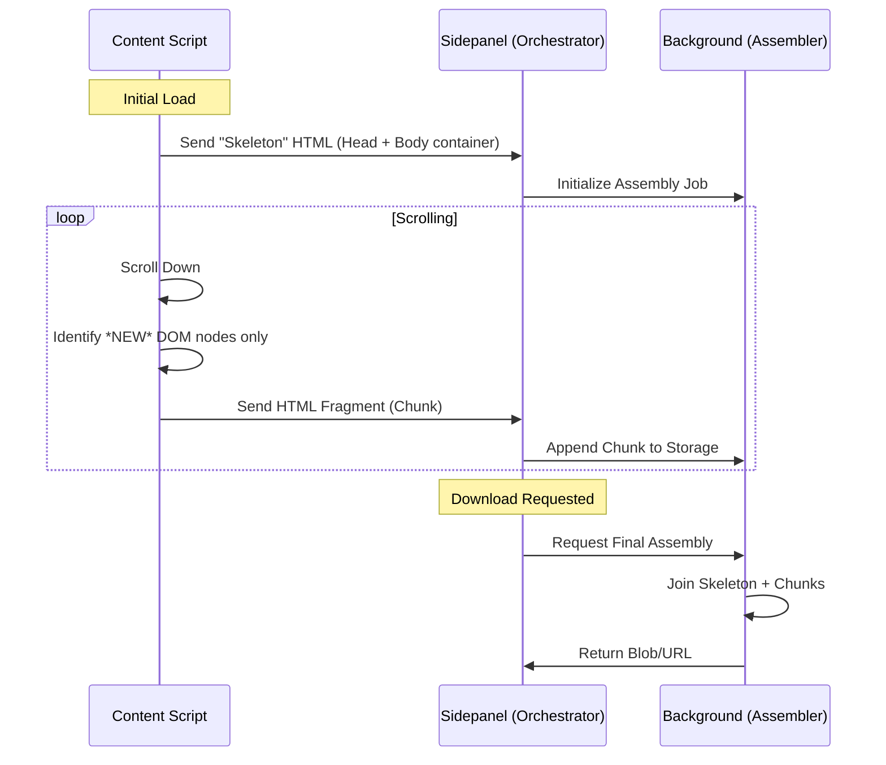

# Large HTML Content Handling Architecture

## 1. Problem Analysis
The current extension suffers from memory exhaustion and size limit breaches (10MB hard limit) because of a "Snapshot & Merge" approach:
1.  **Redundant Data Transfer**: The Content Script sends the *entire* `document.documentElement.outerHTML` after every scroll event.
2.  **Expensive Merging**: The Background script parses two full HTML strings using Cheerio for every scroll step to find differences.
3.  **Memory Duplication**: Large HTML strings are held in React state (Sidepanel), passed to Background, and parsed into DOMs, effectively tripling memory usage.

## 2. Architectural Solution: Differential Scraping & Incremental Assembly

We will transition from a **Snapshot-based** model to a **Stream-based** model.

### High-Level Flow


## 3. Component Design

### A. Client-Side Differential Scraper (`src/client/diffScraper.ts`)
Instead of sending the whole page, we identify the "Dynamic Container" (usually a `div` or `ul` that grows) and only send new children.

*   **Logic**:
    1.  **Initialization**: Identify the scrolling container. Capture `document.head` and the `body` structure *excluding* the dynamic children.
    2.  **Delta Capture**: On scroll, select only elements that appear below the `lastKnownScrollPosition` or are new children of the container.
    3.  **Payload**: `{ type: 'chunk', parentSelector: string, html: string }`

### B. Incremental HTML Assembler (`src/background/HtmlAssembler.ts`)
Replaces `merge-html.ts`. Instead of parsing and merging trees, it acts as a buffer.

*   **Structure**:
    ```typescript
    interface AssemblyJob {
      id: string;
      skeleton: string; // The main page structure with a placeholder
      chunks: string[]; // Array of HTML strings to be inserted
      totalSize: number;
    }
    ```
*   **Operation**:
    *   `addChunk(html)`: Pushes string to array. Updates `totalSize`. O(1) operation.
    *   `finalize()`: `skeleton.replace('<!--PLACEHOLDER-->', chunks.join(''))`.

### C. Adaptive Memory Manager (`src/utils/AdaptiveMemoryManager.ts`)
Replaces static constants in `memoryLimits.ts`.

*   **Dynamic Limit Calculation**:
    ```typescript
    const BASE_LIMIT = 50 * 1024 * 1024; // 50MB
    const MAX_LIMIT = 500 * 1024 * 1024; // 500MB

    function getLimit() {
      if (performance.memory) {
         // Use 80% of available heap or hard cap
         return Math.min(performance.memory.jsHeapSizeLimit * 0.8, MAX_LIMIT);
      }
      return BASE_LIMIT;
    }
    ```
*   **Pressure Handling**:
    *   **Level 1 (Warning)**: Compress chunks (using `CompressionStream` if available or simple deduplication).
    *   **Level 2 (Critical)**: Stop scraping, finalize current content, warn user.

### D. Content Optimizer
*   **Deduplication**: Store hashes of chunks to prevent adding identical content (common in infinite scroll bugs).
*   **Minification**: Simple whitespace removal from chunks before storage.

## 4. Detailed Implementation Logic

### Adaptive Memory Limit Logic
The `AdaptiveMemoryManager` will dynamically adjust limits based on runtime conditions.

```typescript
// src/utils/AdaptiveMemoryManager.ts (Design)

export class AdaptiveMemoryManager {
  private static readonly MIN_LIMIT = 10 * 1024 * 1024; // 10MB
  private static readonly MAX_LIMIT = 500 * 1024 * 1024; // 500MB

  getAvailableMemory(): number {
    // @ts-ignore - Chrome specific
    if (performance && performance.memory) {
      // @ts-ignore
      return performance.memory.jsHeapSizeLimit - performance.memory.usedJSHeapSize;
    }
    return AdaptiveMemoryManager.MIN_LIMIT; // Conservative fallback
  }

  calculateSafeHtmlLimit(): number {
    const available = this.getAvailableMemory();
    // Use 50% of available memory for HTML buffering to leave room for other ops
    const safeLimit = Math.floor(available * 0.5);
    return Math.max(
      AdaptiveMemoryManager.MIN_LIMIT,
      Math.min(safeLimit, AdaptiveMemoryManager.MAX_LIMIT)
    );
  }
}
```

### Incremental HTML Processor Logic
The `HtmlStreamMerger` handles the assembly of chunks.

```typescript
// src/background/HtmlStreamMerger.ts (Design)

export class HtmlStreamMerger {
  private chunks: string[] = [];
  private totalSize = 0;
  private skeleton: string = "";
  private insertionPoint: string = "</body>"; // Default

  initialize(skeletonHtml: string) {
    this.skeleton = skeletonHtml;
    this.chunks = [];
    this.totalSize = skeletonHtml.length;
  }

  addChunk(chunkHtml: string) {
    // 1. Optimization: Check for duplicates (simple hash)
    // 2. Optimization: Minify (remove excessive whitespace)
    const optimizedChunk = this.optimize(chunkHtml);
    
    this.chunks.push(optimizedChunk);
    this.totalSize += optimizedChunk.length;
    
    return this.totalSize;
  }

  finalize(): Blob {
    // Efficiently join strings
    // Find insertion point in skeleton and inject chunks
    const parts = this.skeleton.split(this.insertionPoint);
    const content = [parts[0], ...this.chunks, this.insertionPoint, parts[1] || ""];
    return new Blob(content, { type: 'text/html' });
  }

  private optimize(html: string): string {
    return html.replace(/\s+/g, ' ').trim();
  }
}
```

### Content Optimizer Logic
Strategies to reduce the size of the stored HTML.

1.  **Whitespace Normalization**: Replace multiple spaces/newlines with a single space.
2.  **Attribute Minification**: Remove empty attributes or defaults (optional, risky).
3.  **Deduplication**:
    *   Maintain a `Set<string>` of content hashes (SHA-256 or simple DJB2).
    *   If a chunk's hash exists, discard it.

## 5. Implementation Strategy

### Phase 1: The Assembler (Background)
1.  Create `HtmlAssembler` class.
2.  Implement `addChunk` and `finalize`.
3.  Use `IndexedDB` or `chrome.storage.local` for backing store if memory is tight (optional, start with memory).

### Phase 2: The Scraper (Client)
1.  Modify `src/client/fn.ts`.
2.  Implement `getDynamicContainer()` logic.
3.  Change return type of `scrollDown()` to return deltas.

### Phase 3: Integration
1.  Update `useScrapingDownloader` to handle `INIT` (skeleton) and `UPDATE` (chunk) messages.
2.  Connect to `HtmlAssembler`.

### Phase 4: Safety & Limits
1.  Implement `AdaptiveMemoryManager`.
2.  Add checks in `HtmlAssembler.addChunk()` to respect limits.

## 6. Trade-offs
*   **Complexity**: Higher than simple "snapshot" scraping. Requires identifying the correct container.
*   **Fallback**: If "Dynamic Container" detection fails, we must fall back to the old "Snapshot" method but with stricter limits.
